# What are the most popular hypervisors for infrastructure virtualization?

There are **two** types of hypervisors:
1. **Type 1** - Which are installed directly on server (Bare metal hypervisers).
 - Hyper-V
 - KVM
 - vSphere
 - XenServer
2. **Type 2** - They are installed on top of operating system
  - Oracle VM VirtualBox
  - VMware Workstation Pro/VMware Fusion
  - Parallels Desktop
  
  # Briefly describe the main differences of the most popular hypervisors.
  
- **VMware vSphere with ESX/ESXi**
VMware is an industry-leading vendor of virtualization technology, and many large data centers run on their products. It may not be the most cost-effective solution for smaller IT environments. If you do not need all the advanced features VMware vSphere offers, there is a free version of this hypervisor and multiple commercial editions.

- **KVM (Kernel-Based Virtual Machine)**
KVM is built into Linux as an added functionality. It lets you convert the Linux kernel into a hypervisor. It is sometimes confused with a type 2 hypervisor (see definition below). It has direct access to hardware along with virtual machines it hosts. KVM is an open-source hypervisor that contains all the features of Linux with the addition of many other functionalities. This makes it one of the top choices for enterprise environments. Some of the highlights include live migration, scheduling and resource control, alongside higher prioritization.

- **Microsoft Hyper-V**
Despite VMware’s hypervisor being higher on the ladder with its numerous advanced features, Microsoft’s Hyper-V has become a worthy opponent. Microsoft also offers a free edition of their hypervisor, but if you want a GUI and additional functionalities, you will have to go for one of the commercial versions. Hyper-V may not offer as many features as VMware vSphere package, but you still get live migration, replication of virtual machines, dynamic memory and many other features.

- **Oracle VM**
This hypervisor has open-source Xen at its core and is free. Advanced features are only available in paid versions. Even though Oracle VM is essentially a stable product, it is not as robust as vSphere, KVM or Hyper-V.

- **Citrix Hypervisor (formerly known as Xen Server)**
This Server virtualization platform by Citrix is best suited for enterprise environments. It can handle all types of workloads and provides features for the most demanding tasks. Citrix is proud of its proprietary features, such as Intel and NVIDIA enhanced virtualized graphics and workload security with Direct Inspect APIs.

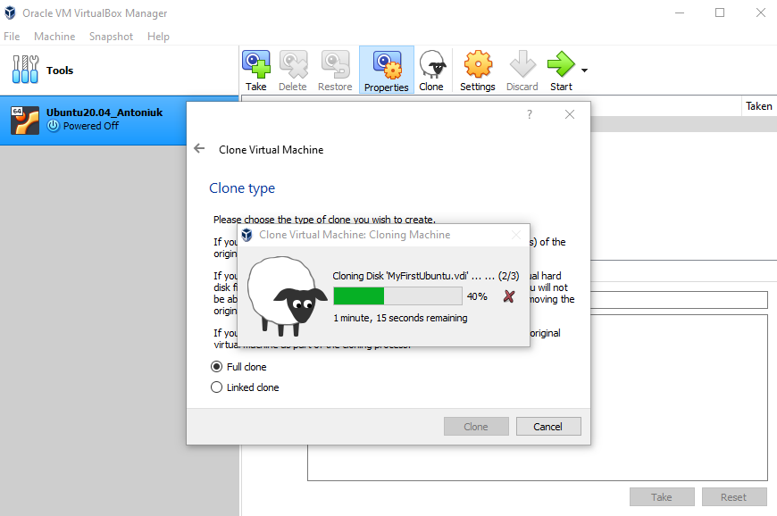
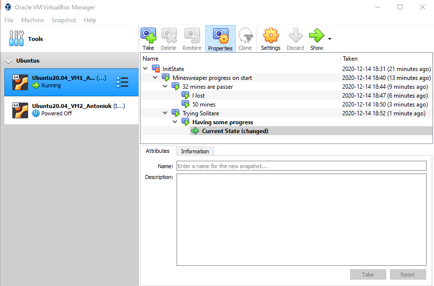
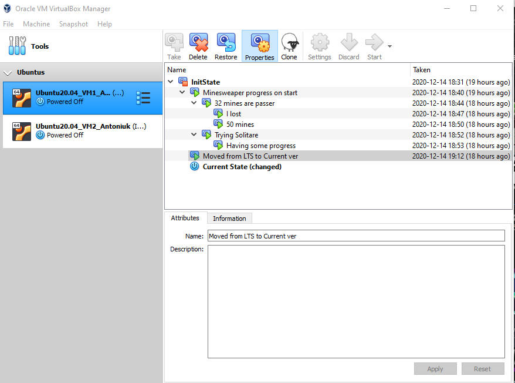
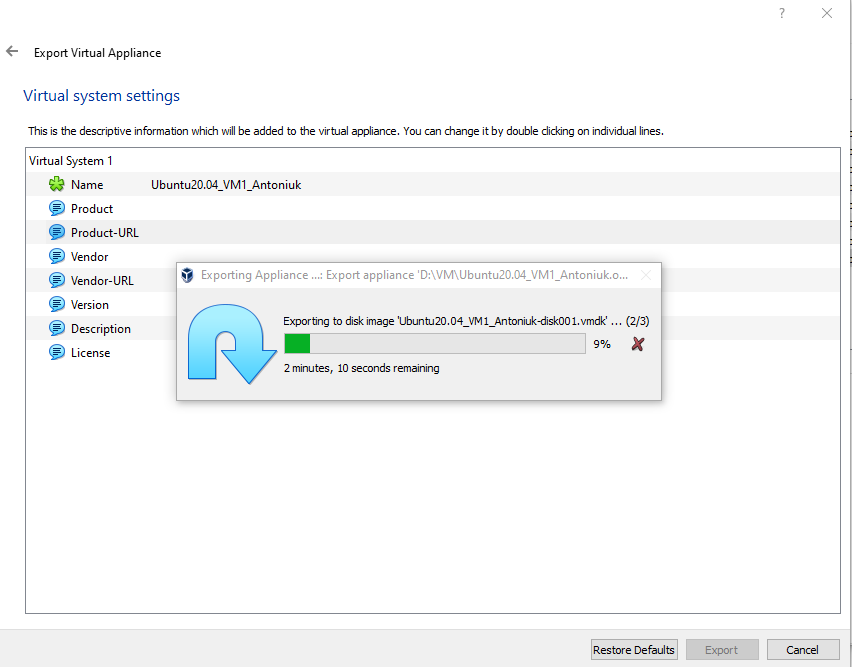
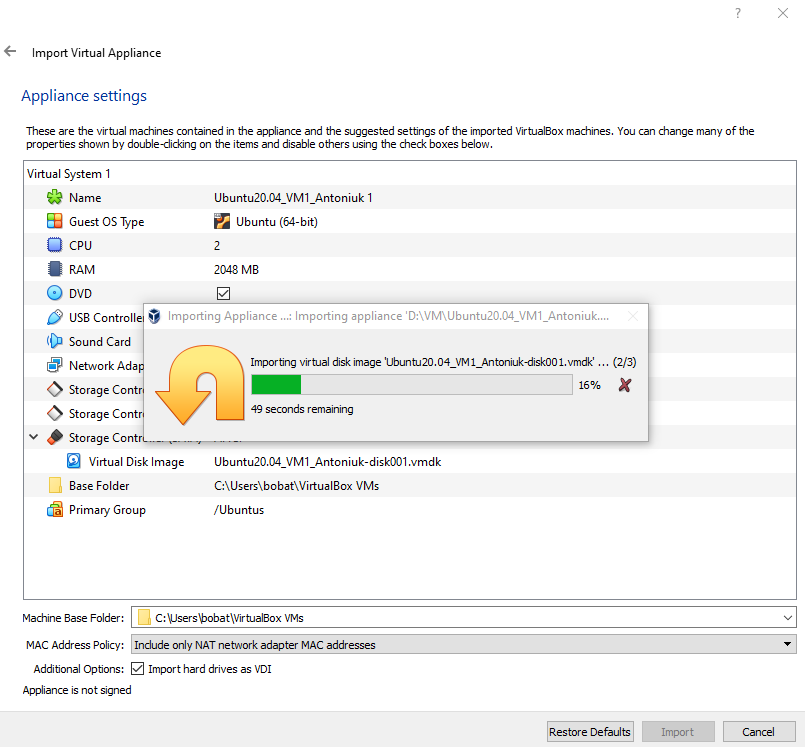
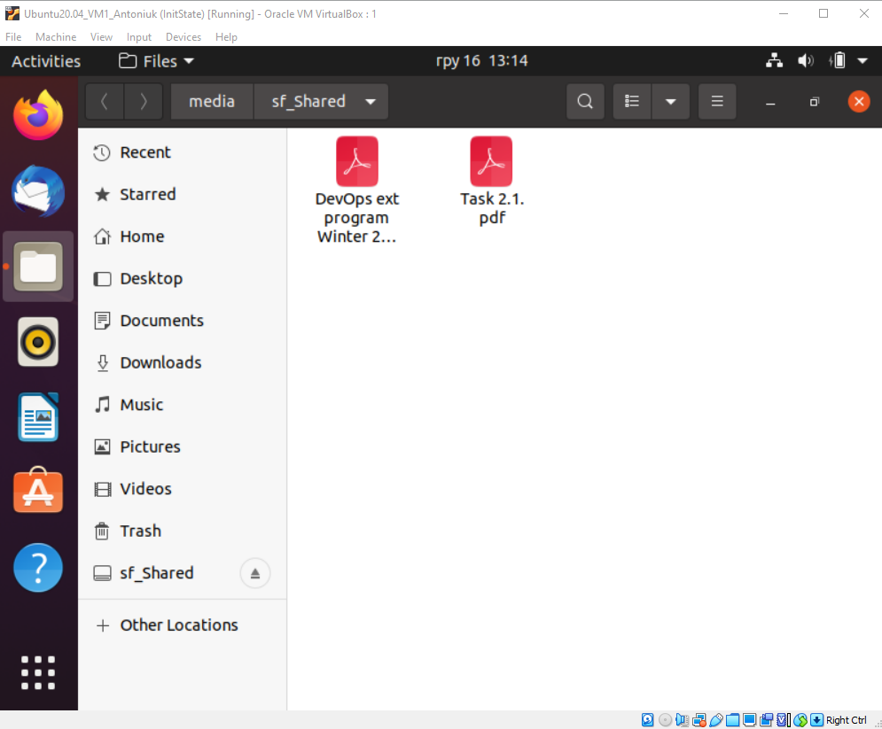
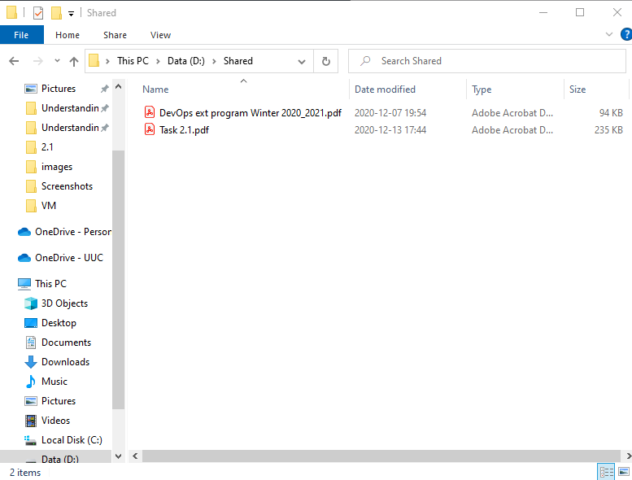
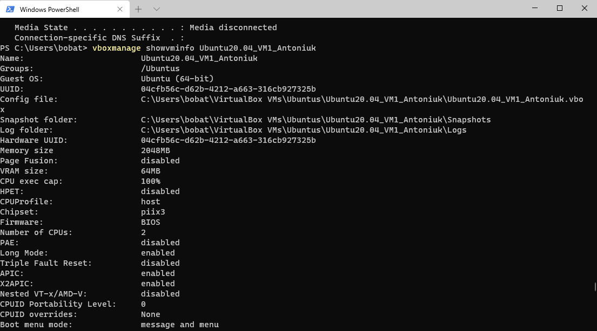
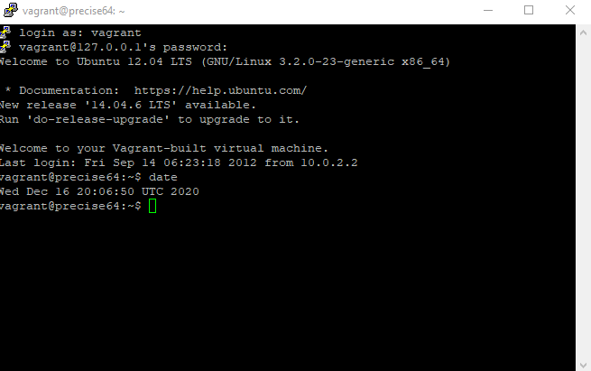
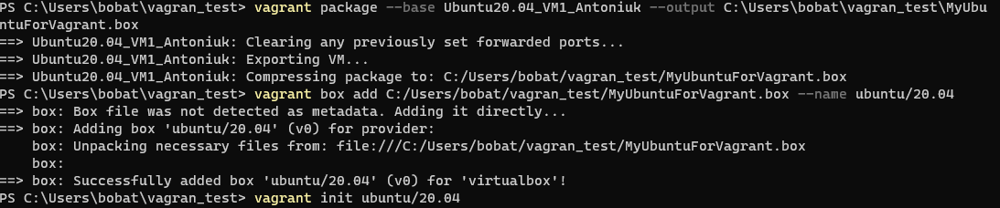
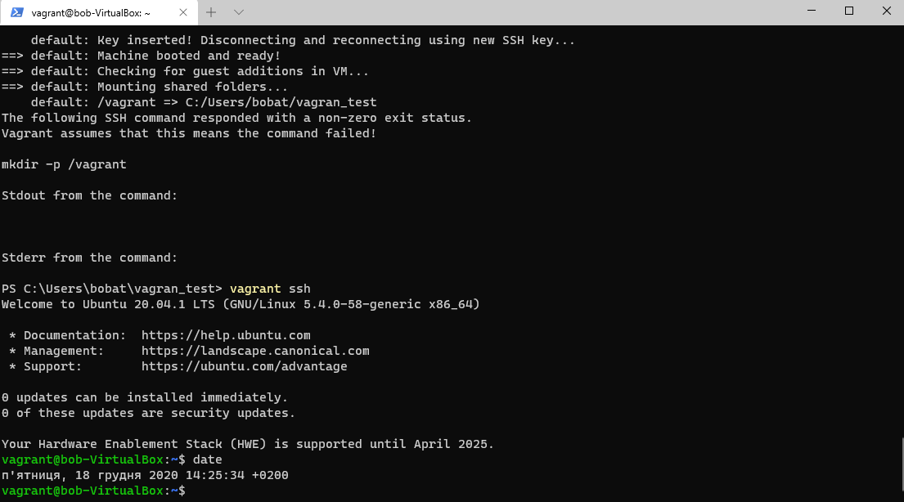

While creating custom vagrant box used [this](https://blog.engineyard.com/building-a-vagrant-box) articte.