# Task 3.1

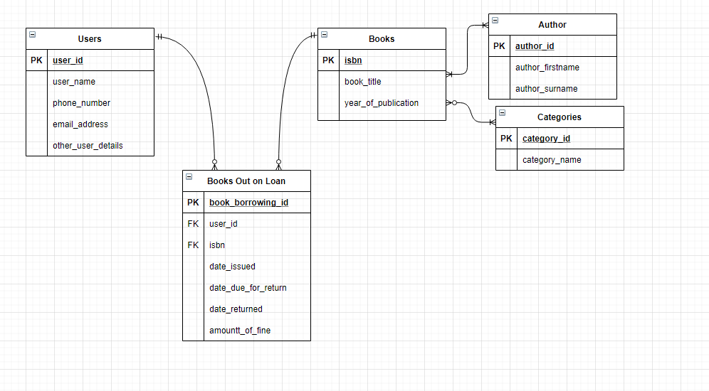

__________________________________________

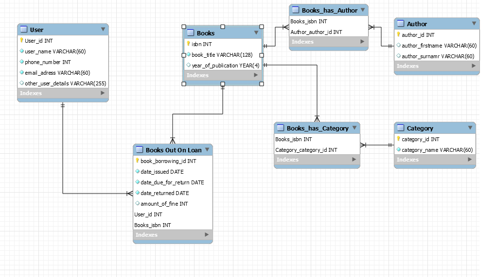

__________________________________________

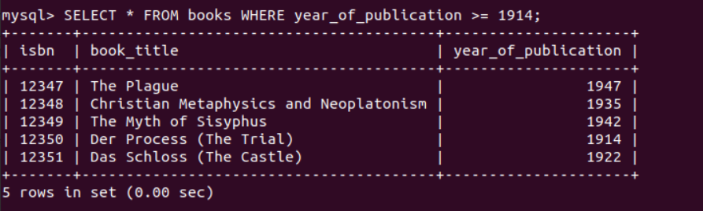

__________________________________________

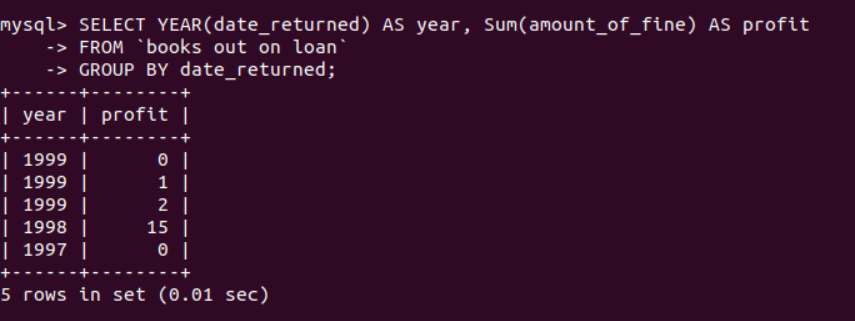

__________________________________________

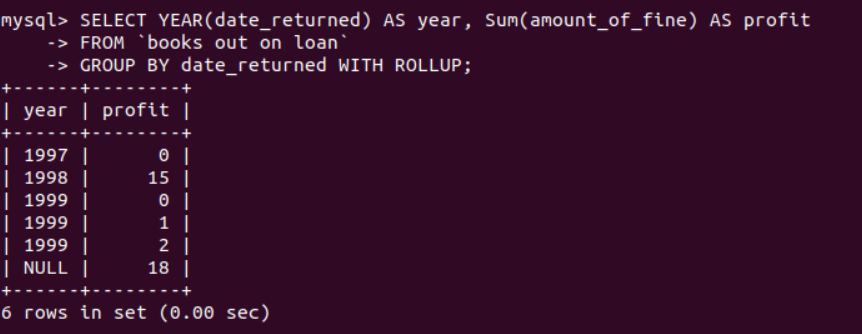

__________________________________________

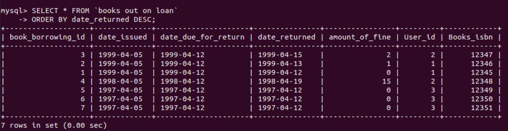

__________________________________________

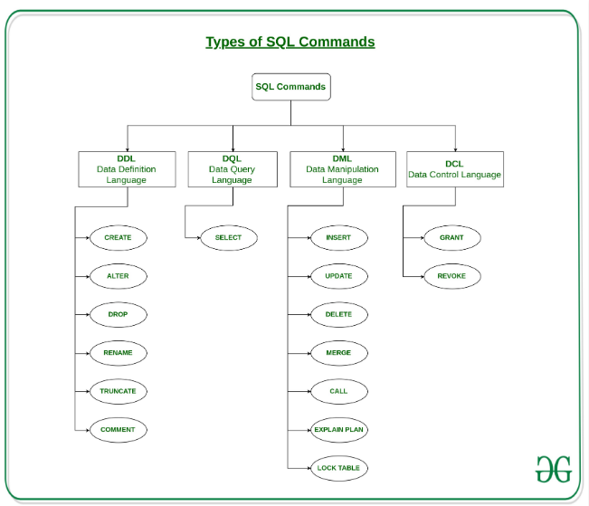

__________________________________________

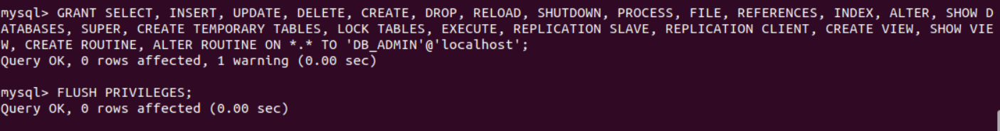

__________________________________________

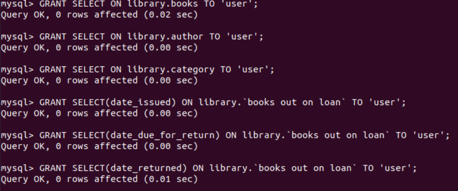

__________________________________________

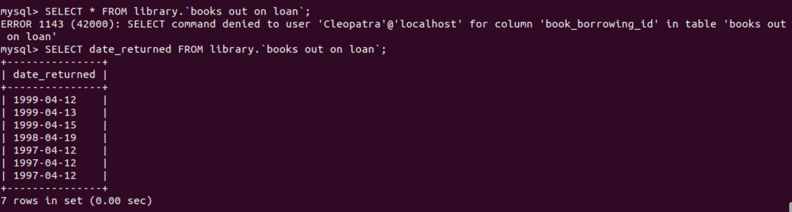

__________________________________________

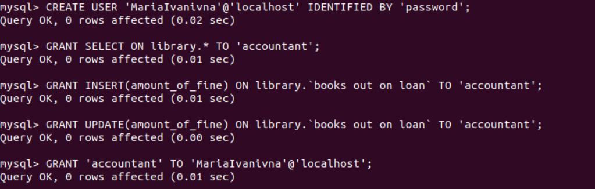

__________________________________________

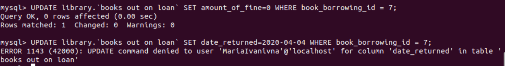

__________________________________________

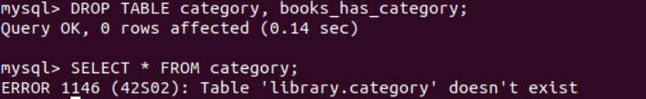

__________________________________________

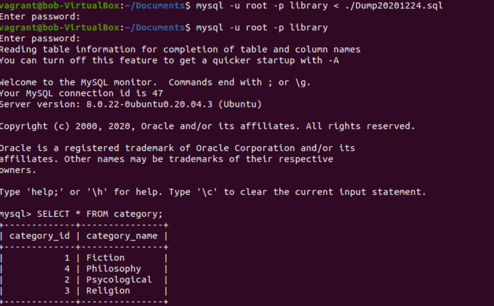

__________________________________________

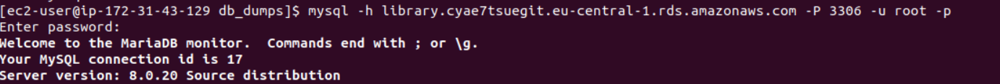

__________________________________________

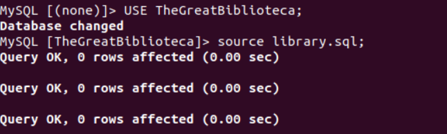

__________________________________________

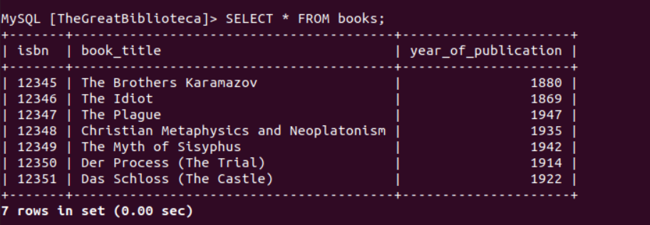

__________________________________________

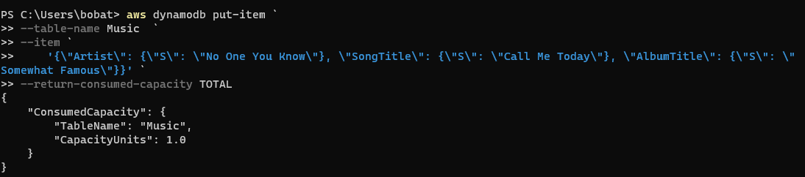

__________________________________________

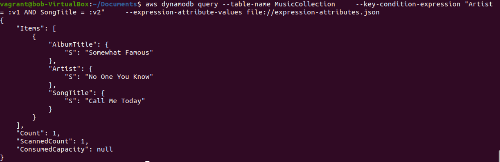