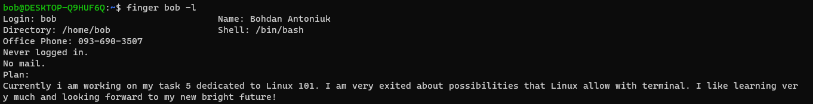

# Task 5.1

2. Basic Options of passwd:
  -a, --all                     report password status on all accounts
  -d, --delete                  delete the password for the named account
  -e, --expire                  force expire the password for the named account
  -h, --help                    display this help message and exit
  -k, --keep-tokens             change password only if expired
  -i, --inactive INACTIVE       set password inactive after expiration
                                to INACTIVE
  -l, --lock                    lock the password of the named account
  -n, --mindays MIN_DAYS        set minimum number of days before password
                                change to MIN_DAYS
  -q, --quiet                   quiet mode
  -r, --repository REPOSITORY   change password in REPOSITORY repository
  -R, --root CHROOT_DIR         directory to chroot into
  -S, --status                  report password status on the named account
  -u, --unlock                  unlock the password of the named account
  -w, --warndays WARN_DAYS      set expiration warning days to WARN_DAYS
  -x, --maxdays MAX_DAYS        set maximum number of days before password
                                change to MAX_DAYS
after changing the password info in /etc/shadow has been changed.

to determine what commands where executed by user read /home/username/.bash_history or to login as a user and type 'history'
__________________________________________

__________________________________________

__________________________________________

__________________________________________

__________________________________________

__________________________________________

__________________________________________

__________________________________________

__________________________________________

# Task 5.1 part 2

__________________________________________

2. Command 'file' is used to determine type of the file.

3. You can go back to home directory by typing two letters in terminal "cd" and pressing enter button. Relative path is relative to where you currently are in directory structure. The '.' sign points to itself (figuratevly speaking) and '..' sign points to previous directory in hierarchy.

4. 

__________________________________________

There are quite a number of different options of "ls" command. The most used are: -a option which lists all files (including hidden), -l option list detailed info about files and folders, -h displays human readable size of files and folders.

5. 