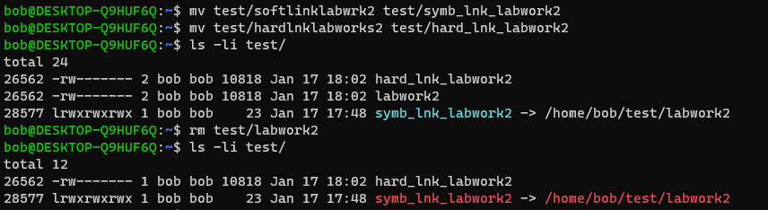
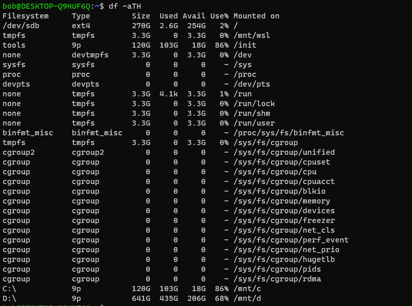

# Task 5.1

2. Basic Options of passwd:
  -a, --all                     report password status on all accounts
  -d, --delete                  delete the password for the named account
  -e, --expire                  force expire the password for the named account
  -h, --help                    display this help message and exit
  -k, --keep-tokens             change password only if expired
  -i, --inactive INACTIVE       set password inactive after expiration
                                to INACTIVE
  -l, --lock                    lock the password of the named account
  -n, --mindays MIN_DAYS        set minimum number of days before password
                                change to MIN_DAYS
  -q, --quiet                   quiet mode
  -r, --repository REPOSITORY   change password in REPOSITORY repository
  -R, --root CHROOT_DIR         directory to chroot into
  -S, --status                  report password status on the named account
  -u, --unlock                  unlock the password of the named account
  -w, --warndays WARN_DAYS      set expiration warning days to WARN_DAYS
  -x, --maxdays MAX_DAYS        set maximum number of days before password
                                change to MAX_DAYS
after changing the password info in /etc/shadow has been changed.

to determine what commands where executed by user read /home/username/.bash_history or to login as a user and type 'history'
__________________________________________

__________________________________________

__________________________________________

__________________________________________

__________________________________________

__________________________________________

__________________________________________

__________________________________________

# Task 5.1 part 2

__________________________________________

2. Command 'file' is used to determine type of the file.

3. You can go back to home directory by typing two letters in terminal "cd" and pressing enter button. Relative path is relative to where you currently are in directory structure. The '.' sign points to itself (figuratevly speaking) and '..' sign points to previous directory in hierarchy.

4. 

__________________________________________

There are quite a number of different options of "ls" command. The most used are: -a option which lists all files (including hidden), -l option list detailed info about files and folders, -h displays human readable size of files and folders.

__________________________________________

__________________________________________

6. 

Soft or symbolic link is easy to define by -> symbol in ls -l command, hard link do not have same symbol, but hard link points to the same inode as source file (ls -li).

Though i changed data using soft link which points to labwork2 file after i opened hard link, data has been changed there too.

After renaming soft and hard links i have access to all data as before. But after deleting labwork2 file, i also lost access to data through soft link.

__________________________________________

__________________________________________

__________________________________________

__________________________________________

__________________________________________

__________________________________________

__________________________________________

13. 

on given example the most left letter on every line represents file or device type. For file types '-' (dash) symbol means - regular file, 'd' - directory, 'l' - link. As for the devicess: 
c - character
b - block
p - pipe
s - socket
The last column for devicess meam - device name.

**Character Device**

These devices transfer data, but one a character at a time. You'll see a lot of pseudo devices (/dev/null) as character devices, these devices aren't really physically connected to the machine, but they allow the operating system greater functionality.

**Block Device**

These devices transfer data, but in large fixed-sized blocks. You'll most commonly see devices that utilize data blocks as block devices, such as harddrives, filesystems, etc.

**Pipe Device**

Named pipes allow two or more processes to communicate with each other, these are similar to character devices, but instead of having output sent to a device, it's sent to another process.

**Socket Device**

Socket devices facilitate communication between processes, similar to pipe devices but they can communicate with many processes at once.

