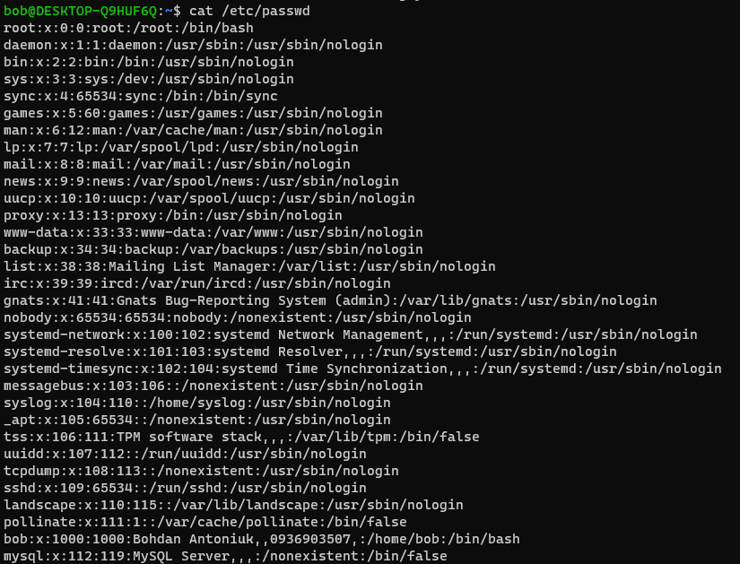
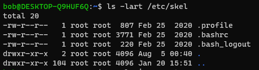
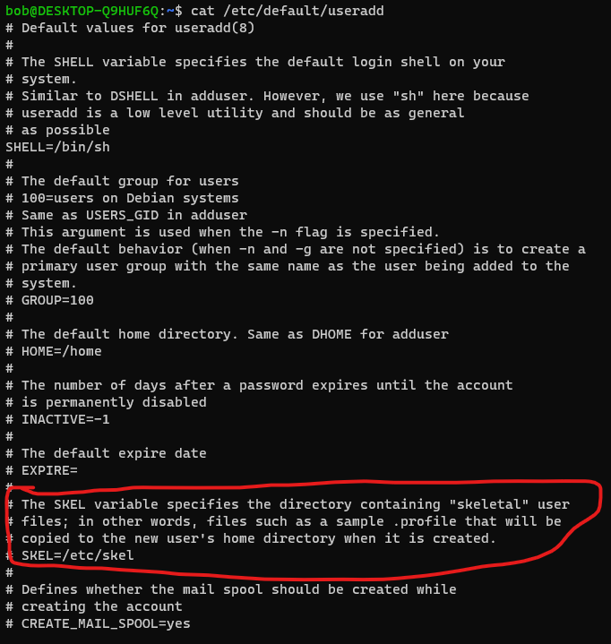
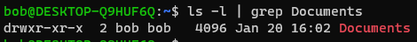
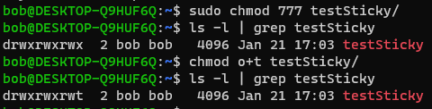
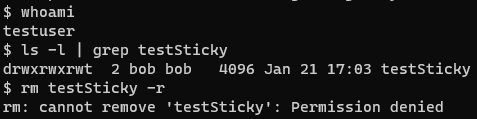

# Task 5.2

1. Usernames aren't really identifications for users. The system uses a user ID (UID) to identify a user. To find out what users are mapped to what ID, look at the /etc/passwd

This file shows you a list of users and detailed information about them. For example, the first line: 
`root:x:0:0:root:/root:/bin/bash`
Each line displays user information for one user, most commonly you'll see the root user as the first line. There are many fields separated by colons that tell you additional information about the user, let's look at them all:

- Username
- User's password - the password is not really stored in this file, it's usually stored in the /etc/shadow file. It contains encrypted user passwords. You can see many different symbols that are in this field, if you see an "x" that means the password is stored in the /etc/shadow file, a "*" means the user doesn't have login access and if there is a blank field that means the user doesn't have a password.
- The user ID - as you can see root has the UID of 0. Service UID are reserved for service (pseudo) users in range from 0 to 999. 
- The group ID
- GECOS field - This is used to generally leave comments about the user or account such as their real name or phone number, it is comma delimited.
- User's home directory
- User's shell - you'll probably see a lot of user's defaulting to bash for their shell

There are real users as well as pseudo users presented in table. I belive pseudo user generaly do not have shell attached to it but it doesn't mean that you can not asign one to it. The example of such a user can be daemon: `daemon:x:1:1:daemon:/usr/sbin:/usr/sbin/nologin` 

Another file that is used in user management is the /etc/group file. This file allows for different groups with different permissions.

`bob@DESKTOP-Q9HUF6Q:~$ cat /etc/group
root:x:0:
daemon:x:1:
bin:x:2:
sys:x:3:
adm:x:4:syslog,bob
tty:x:5:syslog
disk:x:6:
lp:x:7:
mail:x:8:
news:x:9:
uucp:x:10:
...
tss:x:111:
uuidd:x:112:
tcpdump:x:113:
ssh:x:114:
landscape:x:115:
admin:x:116:
netdev:x:117:bob
lxd:x:118:
bob:x:1000:
mysql:x:119:
mlocate:x:120:`

Very similar to the /etc/password field, the /etc/group fields are as follows:

- Group name
- Group password - there isn't a need to set a group password, using an elevated privilege like sudo is standard. A "*" will be put in place as the default value.
- Group ID (GID)
- List of users - you can manually specify users you want in a specific group

5. The main commands for working with Linux accounts are useradd, userdel, and usermod, as well as
the password file editor vipw . The command interface is as follows:
- `useradd [-c uid comment] [-d dir] [-e expire] [-f inactive] [-g gid] [-m [-k skel_dir]] [-s shell]
[-u uid [-o]] username`
- `userdel [-r] username`
- `usermod [-c uid comment] [-d dir [-m]] [-e expire] [-f inactive] [-g gid] [-G gid [, gid]]
[-l new username] [-s shell] [-u uid [-o]] username`
7. Directory /etc/skel/ (skel is derived from the “skeleton”) is used to initiate home directory when a user is first created.

“skeleton” directory is defined in /etc/default/useradd file.
Below is a sample /etc/defualt/useradd file which defines the skel directory. You can change the default location /etc/skel to any other location.

8.  `userdel [-r] username` with -r flag if you vant to remove also mail spool.
9. To lock a users account use the command `usermod -L or passwd -l`. Both the commands adds an exclamation mark (“!”) in the second field of the file /etc/passwd. One of the benefits of locking an account in this way is that it's very easy to unlock the account when and if needed. Just reverse the change by removing the added exclamation point with a text editor or, better yet, by using the `passwd -u` or `usermod -U` command.
10. From documentation i belive it would be `passwd -de username`
11. The command `ls -l` displays extended format of information about the directory.
12. Let's see on example:

 

There are four parts to a file's permissions. The first part is the filetype, which is denoted by the first character in the permissions, in our case since we are looking at a directory it shows **d** for the filetype. Most commonly you will see a **-** for a regular file.

The next three parts of the file mode are the actual permissions. The permissions are grouped into 3 bits each. The first 3 bits are user permissions, then group permissions and then other permissions. I've added the pipe to make it easier to differentiate.

d | rwx | r-x | r-x 
Each character represent a different permission:

- **r**: readable
- **w**: writable
- **x**: executable (basically an executable program)
- **-**: empty

13. If the UID of the file is the same as the UID of the process, the user is the owner of the file. 
If the GID of the file matches the GID of any group the user belongs to, he is a member of the group to which the file belongs. 
If neither the UID no the GID of a file overlaps with the UID of the process and the list of groups that the user running it belongs to, that user is an outsider.
14. `chmod [OPTION]... MODE[,MODE]... FILE...
    chmod [OPTION]... OCTAL-MODE FILE...
    chmod [OPTION]... --reference=RFILE FILE...` command is used to change  access to folders and files. 
    
First, pick which permission set you want to change, user, group or other. You can add or remove permissions with a + or -, let's look at some examples.

**Adding permission bit on a file**

`$ chmod u+x myfile`
The above command reads like this: change permission on myfile by adding executable permission bit on the user set. So now the user has executable permission on this file!

**Removing permission bit on a file**

`$ chmod u-x myfile`

**Adding multiple permission bits on a file**

`$ chmod ug+w`
There is another way to change permissions using numerical format. This method allows you to change permissions all at once. Instead of using r, w, or x to represent permissions, you'll use a numerical representation for a single permission set. So no need to specify the group with g or the user with u.

The numerical representations are seen below:

- **4**: read permission
- **2**: write permission
- **1**: execute permission
Let's look at an example:

**$ chmod 755 myfile**

So now 755 covers the permissions for all sets. The first number (7) represents user permissions, the second number (5) represents group permissions and the last 5 represents other permissions.

Wait a minute, 7 and 5 weren't listed above, where are we getting these numbers? Remember we are combining all the permissions into one number now, so you'll have to get some math involved.

7 = 4 + 2 + 1, so 7 is the user permissions and it has read, write and execute permissions

5 = 4 + 1, the group has read and execute permissions

5 = 4 +1, and all other users have read and execute permissions

15. Sticky Bit is mainly used on folders in order to avoid deletion of a folder and it’s content by other users though they having write permissions on the folder contents. If Sticky bit is enabled on a folder, the folder contents are deleted by only owner who created them and the root user. No one else can delete other users data in this folder(Where sticky bit is set). This is a security measure to avoid deletion of critical folders and their content(sub-folders and files), though other users have full permissions.

16. The file must have executable privilages in order to be able to function as script.