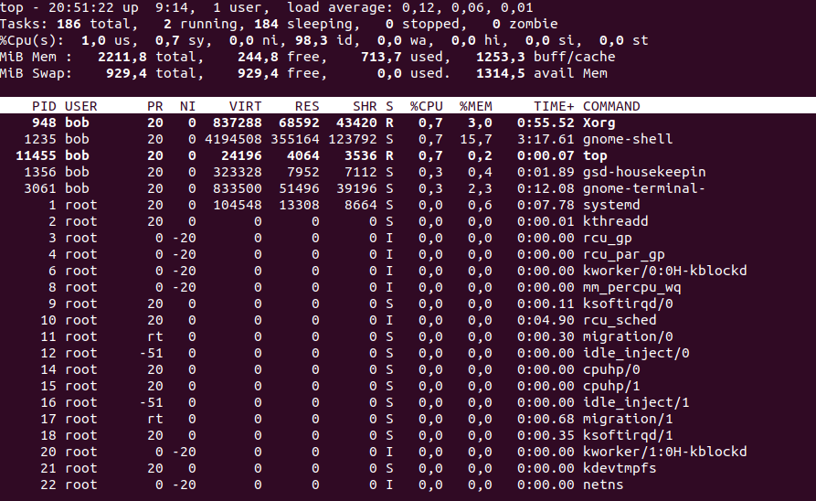

# Task 5.3

1. 

2. 

3. If everything is a file in linux, processes must implement this logic too. /proc folder represents all processes and resorses that are in OS. Using `$ cat /proc/PID/status` gives access to detailed info about process.

4. 

5. 

6. One way to recognize kernel processes is that they don't use any user memory, so the vsz field is 0. 

User-space processes have its own virtual address space.

Kernel processes or threads do not have their own address space, they operate within kernel address space only. And they may be started before the kernel has started any user process (e.g. init).

Also kernel processes are in square brackets in COMMAND column.

7. Here is a list of the various process statuses and what they mean: **D** – Uninterruptible sleep (usually a critical system process, a process that cannot be killed without rebooting) **R** – Running or runable (on run queue) **S** – Interruptible sleep (waiting for an event to complete) **T** – Stopped, either by a job control signal or because it is being traced. **Z** – Defunct (“zombie”) process, terminated but not closed by the parent process that created it Additional characters may be seen if in a BSD environment or when using the “stat” modifier with ps: **W** – has no resident pages **<** – high-priority process **N** – low-priority task **L** - has pages locked into memory (for real-time and custom IO) 

8. 

9. top, htop

10. 

11. `top -u bob`

12. shift + N - sort by PID
			P - sort by CPU usage
			M - sort by Memory usage
			T - sort by Time usage
			Z - change colors
press h for help

14. Every command in Linux has some priority. Default priority is 20. Use `nice` command to start process with priority and `renice` to change priority. 

15. You can change priority from top utility using 'r' key. 

16. Commonly used signals: 
The signal **SIGTERM (15)** is used to ask a process to stop.
The signal **SIGKILL (9)** is used to force a process to stop.
The **SIGHUP (1)** signal is used to hang up a process. The effect is that the process will reread its configuration files, which makes this a useful signal to use after making modifications to a process configuration file.
To send signal to process PID is needed and name of signal or it's number.

# Part 2

1. OpenSSH has been added to Windows as of autumn 2018, and is included in Windows 10 and Windows Server 2019.

Due to some differences between OS and implementation issues some features of ssh are not present on Windows:

###PermitRootLogin

Not applicable in Windows. To prevent administrator login, use Administrators with DenyGroups directive.

###Not supported

The following configuration options are not available in the OpenSSH version that ships in Windows Server 2019 and Windows 10 1809:

- AcceptEnv
- AllowStreamLocalForwarding
- AuthorizedKeysCommand
- AuthorizedKeysCommandUser
- AuthorizedPrincipalsCommand
- AuthorizedPrincipalsCommandUser
- Compression
- ExposeAuthInfo
- GSSAPIAuthentication
- GSSAPICleanupCredentials
- GSSAPIStrictAcceptorCheck
- HostbasedAcceptedKeyTypes
- HostbasedAuthentication
 -HostbasedUsesNameFromPacketOnly
- IgnoreRhosts
- IgnoreUserKnownHosts
- KbdInteractiveAuthentication
- KerberosAuthentication
- KerberosGetAFSToken
- KerberosOrLocalPasswd
- KerberosTicketCleanup
- PermitTunnel
 -PermitUserEnvironment
- PermitUserRC
- PidFile
- PrintLastLog
- RDomain
- StreamLocalBindMask
- StreamLocalBindUnlink
- StrictModes
- X11DisplayOffset
- X11Forwarding
- X11UseLocalhost
- XAuthLocation

2. I created key pair `ssh-keygen` on client, copied to server with `ssh-copy-id *username*@*hostname*`. On server turned off **PermitRootLogin** option and added *AllowUsers* *username* by *editing /etc/ssh/sshd_config* file. 

3. The type of key to be generated is specified with the -t option.  If invoked without any arguments, ssh-keygen will generate an RSA key.
**-t** dsa | ecdsa | ecdsa-sk | ed25519 | ed25519-sk | rsa
	Specifies the type of key to create.  The possible values are “dsa”, “ecdsa”,
	“ecdsa-sk”, “ed25519”, “ed25519-sk”, or “rsa”.

4. 